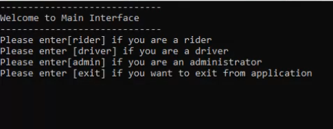

# Cab Booking System
### Project Objective
To design a CAB Booking Platform where Riders can book nearest
Available Drivers. The Program should be extensible to add new features
Whenever possible.
### Build using
1. Python 3.8 latest version python language. 
2. Have imported Math and Time modules to perform various operations.
3. Build and tested on windows 10
### Prerequisites
•	python 3.8 (Install this from the  official website https://www.python.org/)
•	Basic knowledge of how to use command prompt
### Product Features
•       Registration and Identification of Rider , Driver , Admin Accounts

•	Options available for Rider Account:
        1)CAB Booking.
	2)Updation of location.
	3)History of rides.
	4)Ending a Trip.
	
•	Options available for Driver Account:
	1)Updation of CAB Availablity.
	2)CAB Location Updation.
	
•	Options available for Admin Account:
	1)Access to View all Current ongoing Rides.
	2)Access to View all Registered Riders and Drivers Data.

• 	When user wants to book a CAB this program will automatically search the first available nearest Driver within a Radius of 8km and assigns it.

• 	Exception handling is done for all the User Inputs.

• 	When user wants to book a CAB this program will automatically search the first available nearest Driver within a Radius of 8km and assigns it.

### Demo Video
https://drive.google.com/file/d/1hys8DUgYfPDreHqAlNGYjRb5p4uNDyHb/view?usp=sharing

### Flow Chart

### Screen shots

### Steps to run the program
1.	Copy  “.py” to your desired location.
2.	Execute the file from command prompt.
